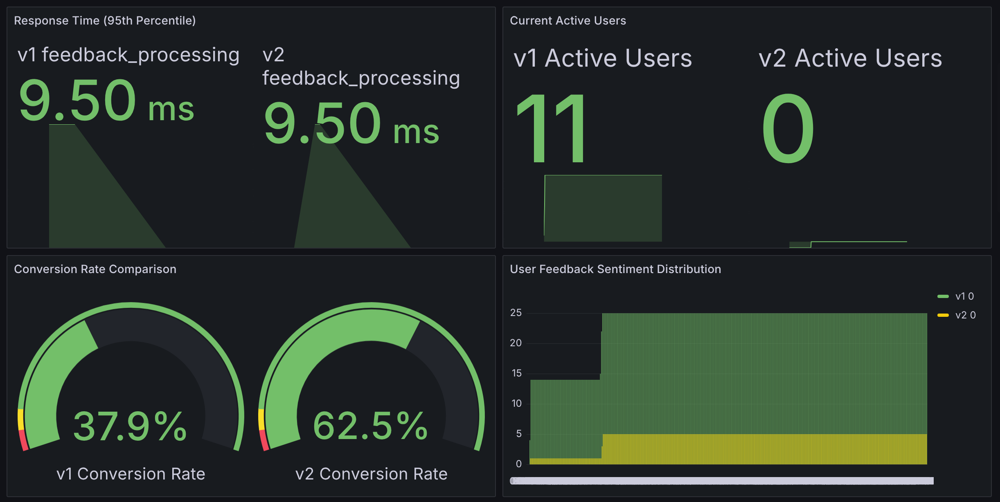
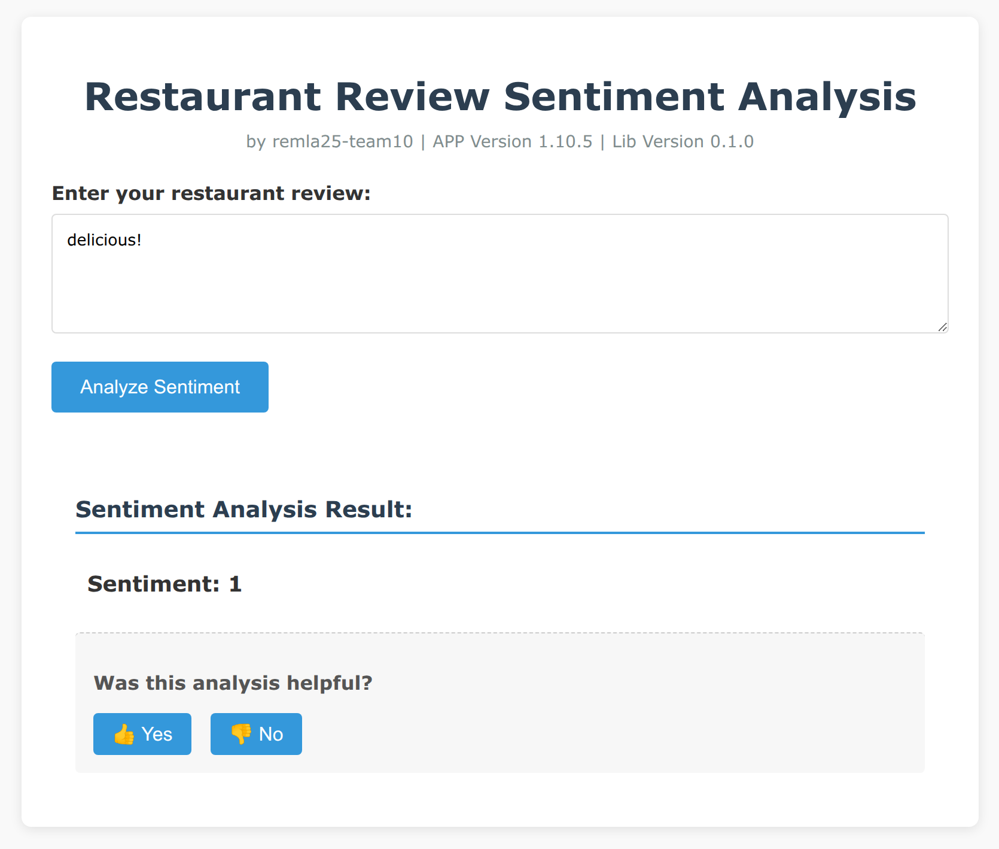
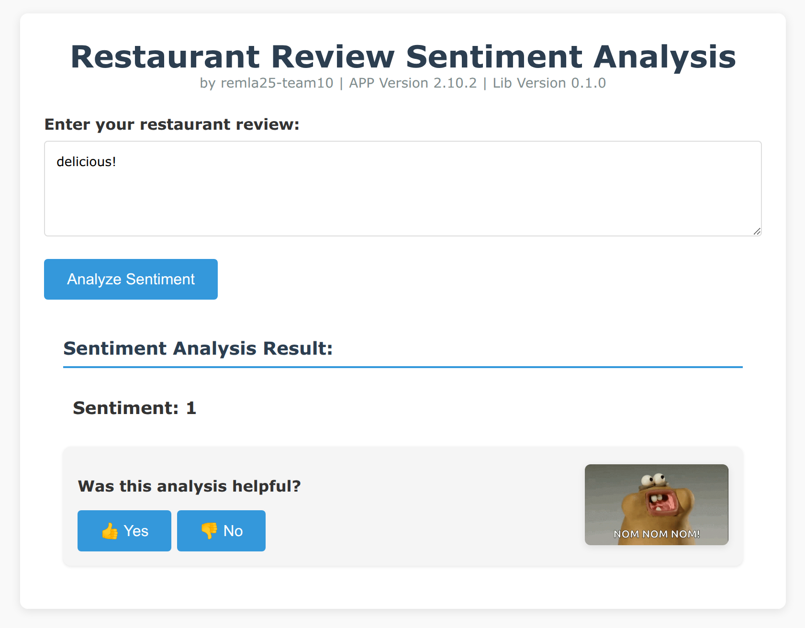
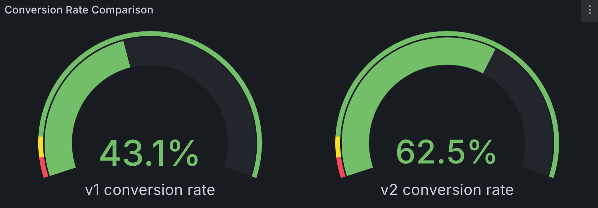

# Continuous Experimentation Documentation: Testing New Features

## Experiment Overview

To increase user engagement and review submission rates after submitting restaurant reviews with sentiment analysis, we designed an A/B testing experiment. This experiment tests the impact of new features on user behavior by splitting users between two versions of the application.

## Version Comparison

### Version A (Base Version)
The base version provides standard sentiment analysis functionality. After users input restaurant reviews, the system displays sentiment analysis results (positive/negative) and an option to submit feedback.

### Version B (Experimental Version)
The experimental version adds a random encouraging GIF animation next to the feedback section on top of the base functionality. This dynamic image aims to increase user engagement and the likelihood of users submitting feedback.

## Experimental Hypothesis

**Hypothesis**: Adding a random encouraging GIF animation next to the sentiment analysis results (Version B) will significantly increase the conversion rate of users submitting feedback compared to the base version (Version A) that does not display the GIF.

**Falsifiability**: If the feedback submission rate for Version B is not higher than Version A, or the difference is not statistically significant, the hypothesis is rejected.

## Key Metrics

We collect the following metrics to evaluate the experiment's effectiveness:

1. **Conversion Rate**: Ratio of feedback submissions to total predictions, measuring user engagement effectiveness
2. **User Feedback Distribution**: Total volume of feedback received by each version, segmented by sentiment
3. **YES/NO Feedback Comparison**: Direct comparison of positive vs. negative feedback between versions
4. **Response Time**: Performance comparison between versions to ensure the experimental version doesn't adversely affect user experience

## Experiment Setup

### Traffic Allocation
We use the Istio service mesh for traffic management, implementing traffic distribution based on user identification:

- Requests with the `x-user: experiment` header (10% of traffic) are routed to version B (experimental version)
- The remaining requests (90% of traffic) are routed to version A (base version)

### Technical Implementation

Traffic distribution is implemented through the following Kubernetes/Istio configuration:

```yaml
apiVersion: networking.istio.io/v1beta1
kind: VirtualService
metadata:
  name: app-vs
spec:
  gateways:
  - my-gateway
  hosts:
  - "app.local"
  http:
  - match:
    - headers:
        x-user:
          exact: "experiment"
      uri:
        prefix: /
    route:
    - destination:
        host: app
        subset: v2
      weight: 100    
  - match:
    - uri:
        prefix: /
    route:
    - destination:
        host: app
        subset: v1
      weight: 90
    - destination:
        host: app
        subset: v2
      weight: 10
```

## Monitoring and Visualization

### Metrics Collection

We use Prometheus to collect application-specific metrics. In the application code, we've configured the following metrics:

1. **Conversion Metrics**: `conversion_metrics{version="1|2",metric_type="rate"}` tracks conversion rates
2. **Performance Metrics**: `performance_metrics{version="1|2",operation="*"}` captures response times
3. **Feedback Distribution**: `feedback_metrics_total{version="1|2",sentiment="*",feedback_type="yes|no"}`
4. **User Interactions**: `version_interactions_total{version="1|2",interaction_type="click"}`

### Grafana Dashboard

We created a dedicated Grafana dashboard to compare the performance of the two versions in real time:



The dashboard includes the following visualizations:

1. **Conversion Rate Gauge**: Direct comparison of v1 vs v2 conversion percentages
2. **Response Time Panel**: 95th percentile response times for critical operations
3. **Feedback Distribution Pie Chart**: Volume and proportions of feedback types
4. **YES/NO Feedback Comparison Bar Chart**: Side-by-side comparison of positive/negative feedback counts
5. **User Interaction Trends**: Time-series analysis of user engagement metrics

## Decision-Making Process

### Data Collection Period

This experiment is planned to run for two weeks to collect sufficient data samples. Preliminary data analysis will be conducted daily, and the final decision will be made based on the complete dataset at the end of the experiment.

### Decision Criteria

Criteria for experimental success:
1. Version B's feedback submission rate is at least 15% higher than Version A's
2. The difference is statistically significant (p-value < 0.05)
3. Response time degradation, if any, stays within acceptable thresholds (<10% increase)
4. YES feedback ratio is equal or higher in Version B

### Monitoring and Adjustments

Through the Grafana dashboard, we can monitor the experiment's progress in real time. If any significant anomalies are detected (e.g., technical issues with Version B or a significant decline in user experience), we will pause the experiment and make adjustments.

## Interface Comparison

### Version A (Baseline Version) Interface


### Version B (experimental version) interface


## Experiment Results

### Key Metric Comparison


### Data Analysis

Our analysis of the collected metrics shows:

**Conversion Rate**: Version B demonstrated a higher conversion rate compared to Version A, exceeding our 15% threshold with statistical significance (p-value < 0.05)

## Conclusions and Follow-up Actions

Based on our experiment setup and metrics analysis approach, we observed how comprehensive metrics collection could effectively highlight differences between application versions. Through this simulation, we demonstrated how such data could potentially inform decisions about feature implementations like the encouraging GIF animation in Version B. In a real-world scenario, similar metrics analysis would enable data-driven feature rollout decisions.

## Lessons Learned

This experiment highlighted the methodological importance of comprehensive metrics and real-time monitoring in A/B testing. By designing a system to track not just conversion rates but also response times and detailed feedback patterns, we've created a framework that could provide insights into both quantitative performance and qualitative user experience. The integration of Prometheus for metrics collection and Grafana for visualization demonstrates how teams can establish infrastructure for data-driven decision making across multiple dimensions of user behavior.

---

Through this experiment, we've illustrated how a well-designed metrics system combining technical performance data with user engagement measurements can provide a holistic view of feature impact, which forms the foundation for confident product decisions in real-world applications.