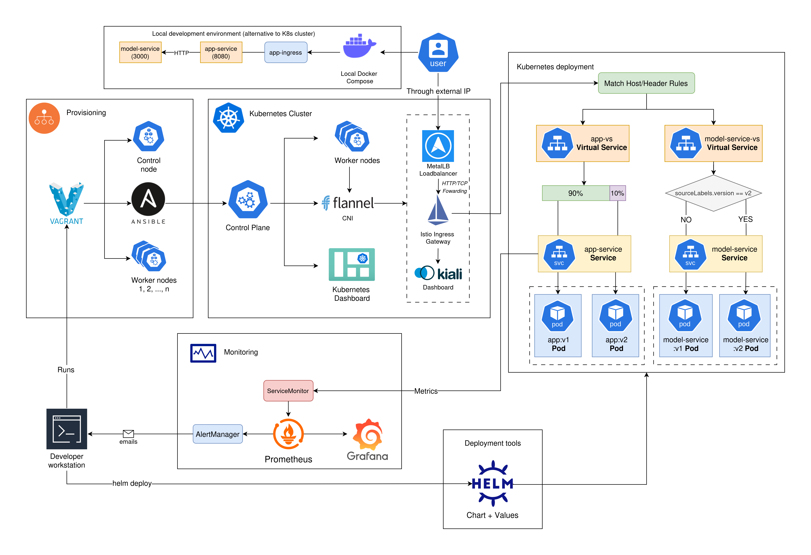

# Deployment Structure
In this document we outline the architecture of our sentiment analysis application and its deployment. We elaborate on the flow and configuration behind the setup to make it easier to understand the project on a high-level.

## 1. Project Overview

The application follow a microservice architecture and is deployed on a Kubernetes cluster (with Helm), utilizing an Istio service mesh for traffic management and observability. The following visualization gives a high-level overview of the project's components and their interactions, alongside the general data flow:

**Figure 1:** High level overview of the deployed (relevant) resources. This includes provisioning, KB cluster, and KB deployment, alongside Monitoring and the local Docker-Compose option.

More specifically, the project deployment process consists of the following:
- **Application Services** The application follows a microservice architecture with the following services:
    - `app-service`: contains the app's frontend and backend service. It makes POST requests to the model service in order to predict the sentiment of the user's input (i.e. the restaurant review).
    - `model-service`: wrapper service for the released ML model, using REST API to expose the model to the other microservice components. It is only internally accessible via the app-service.
- **Kubernetes Cluster** provisioned with Vagrant and Ansible, and orchestrates all workloads and resources.
- **Istio Service Mesh** Manages traffic routing and observability It is the primary gateway for the user through an external IP exposed by MetalLB.
- **Monitoring Stack**: Enables monitoring with Prometheus, providing visualizations with Grafana, and traffic observability with Kiali and Jaeger.
- **Local Docker Compose**: Local deployment possibility with Docker Compose

## 2. Deployment Structure

### Kubernetes Cluster
The Kubernetes cluster is first provisioned using Vagrant and Ansible, using bare-metal Virtual Machines with VirtualBox. It sets up a cluster consisting of a control node, and a user-specified number of worker nodes, each running the application workloads (pods). This is followed by the Ansible playbook provisioning which further configures the project setup and ensures the nodes are joined in a cluster.

When this is done, the cluster utilizes Flannel CNI for pod networking, MetalLB for load balancing and Ingress Controller (NGINX) for handling external traffic into the cluster.

### Istio Service Mesh

Istio is installed as the service mesh for our cluster. The deployment is defined by using a Helm chart, which is detailed in `/model-stack-fresh`. It consists of the following resources:

- **Istio Ingress Gateway:** the entry point for all HTTP traffic managed by Istio.
- **Dynamic Routing:** Makes use of Istio VirtualServices and DestinationRules to enable routing, including:
    - **A/B Testing:** A user is routed to either the `v1` (stable) or `v2` (canary) version of the app according to a 90/10 split.
    - **Sticky sessions:**  If the initial request contains the HTTP header `x-user`, the user is assigned a cookie indicating the version they were routed to. This ensures consistency on subsequent requests.
- **Observability:** Integration with Kiali (service mesh visualization) and Jaeger (distributed tracing).

### Monitoring Stack

Monitoring is done using Prometheus. The metrics themselves are collected from the configured pods and services, and are then used by Prometheus for analysis. It consists of the following:
- **ServiceMonitor**: Scrapes the metrics from the application via the app service's `/metrics` endpoint. 
- **Grafana:** ConfigMaps are used to apply grafana configurations. These process and visualize the metrics in real time via a dashboard.
- **AlertManager:** Sends alerts via email when specific events occur (in our case a high request rate within 2 minutes).

## 3. Usage Flow

The user sends an HTTP request to the cluster's external IP (exposed by MetalLB). It forwards the request to the Istio Ingress Gateway.

After that, the Istio VirtualService for `app-service` matches the requests and applies the dynamic routing logic (to either v1/v2 of the app).

`app-service` then processes the request, and calls `model-service` for ML inference. `model-service` returns the result back to `app-service`, which returns the predicted sentiment.

The user then has the option to provide feedback to the sentiment result (indicated with a thumbs up or thumbs down button). An additional GIF is present in the canary (v2) version (with the goal of boosting engagement, further details in `continuous-experimentation.md`).

In case of using the Docker Compose setup, the user makes requests via configurable ports for the app/model service to achieve the same behaviour.